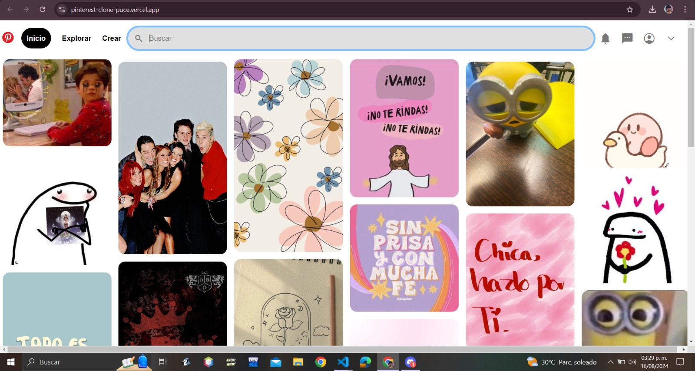

# Clone de Pinterest
## Proyecto  responsivo realizado con Bootstrap 5 
Proyecto creado durante el bootcamp de Tecnolochicas PRO, este proyecto nos ayudo a practicar tanto la estructuraa html para realizar una pagina web asi como CSS para estilos con la creacion de un  clone de Pinterest😁 

Podrás encontrarlo aquí [Clon](https://pinterest-clone-puce.vercel.app/).
### Tecnologías
* HTML
* CSS
### El proyecto cuenta con:
* Las imagenes ya definidas
* Botones que aun no tienen funcionabilidad

